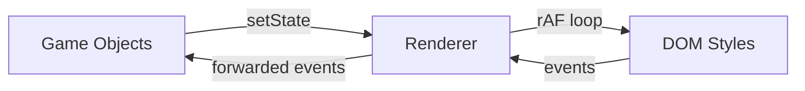
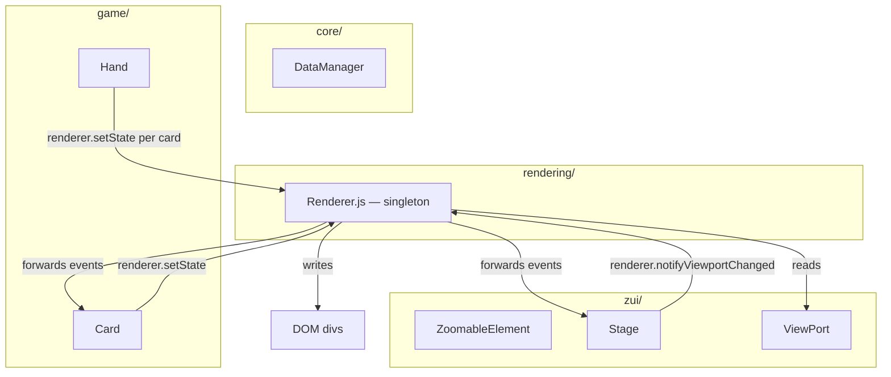

# Design Document: Rendering Separation

## Overview

A Renderer singleton sits between game objects and the DOM. Objects mutate state via `renderer.setState()`, the Renderer batches changes and applies them once per frame via `requestAnimationFrame`. This eliminates scattered `div.style.*` calls and centralizes layout computation, input handling, and coordinate conversion.



The flow:
1. Game object calls `renderer.setState(objectId, 'x', 100)`
2. Renderer compares against `entry.state.x` — if different, writes the new value to `entry.state.x`, marks object dirty, records changed field
3. On next animation frame, Renderer computes bounds and writes DOM styles
4. Mouse events on root element are hit-tested and forwarded to the owning object

Because `setState` writes directly to the object's StateObject reference, serialization continues to work unchanged — the StateObject always reflects the current truth.

## Architecture



Single file: `rendering/Renderer.js`. No sub-modules, no abstract layers. No external dependencies — vanilla JavaScript and browser APIs only. No bundler, transpiler, or package manager required. All imports are relative paths to local `.js` files.

## Components and Interfaces

### Renderer Singleton

```js
// rendering/Renderer.js
import { dataManager } from '../core/DataManager.js';

class Renderer {
    constructor() {
        this.entries = new Map();   // objectId → entry
        this.rootEl = null;
        this.running = false;
        this.frameId = null;
        this.dragTarget = null;     // objectId of object being dragged, or null
    }
}

export const renderer = new Renderer();
```

Each entry in the map:

```js
{
    objectId: 7,
    state: card.state,          // reference to the object's StateObject
    div: divElement,            // the DOM element the Renderer manages
    dirty: false,
    changedFields: new Set(),   // e.g. {'x', 'y', 'zIndex'}
    bounds: { x: 0, y: 0, width: 0, height: 0 },  // computed screen-pixel bounds
    layoutPreset: { positionBehaviour, positionType, dimensionsBehaviour, dimensionsType, scaleWithWindowSize },
    parentId: 3,                // objectId of parent (for layout computation)
    viewportId: 2               // objectId of the governing viewport (for ZOOM objects)
}
```

### Public API

```js
// --- Lifecycle ---
renderer.start(rootEl)          // attach listeners to rootEl, start rAF loop
renderer.stop()                 // cancel rAF, remove listeners

// --- Registration ---
renderer.register(objectId, { state, div, parentId, viewportId })
renderer.unregister(objectId)

// --- State mutation ---
renderer.setState(objectId, field, value)

// --- Queries ---
renderer.getComputedBounds(objectId)   // → { x, y, width, height }
renderer.screenToLocal(clientX, clientY, objectId)  // → { x, y }
renderer.localToViewport(localX, localY, stageObjectId)  // → { x, y }

// --- Dirty propagation ---
renderer.notifyViewportChanged(viewportId)  // marks ZOOM objects under this viewport dirty
renderer.markAllDirty()                     // called on window resize

// --- Drag ---
renderer.startDrag(objectId)    // captures move/up events to this object
renderer.endDrag()              // releases capture
```

### How Objects Use It

Before (current code in ZoomableElement):
```js
moveTo(x, y) {
    this.state.x = x;
    this.state.y = y;
    this.repositionDiv();  // immediate DOM write
}
```

After (migrated):
```js
moveTo(x, y) {
    renderer.setState(this.state.objectId, 'x', x);
    renderer.setState(this.state.objectId, 'y', y);
    // DOM update happens next frame
}
```

## Data Models

### Renderable State Fields

The fields that `setState` accepts and the Renderer applies to DOM:

| Field | DOM property | Notes |
|-------|-------------|-------|
| x | left | After bounds computation |
| y | top | After bounds computation |
| width | width | After bounds computation |
| height | height | After bounds computation |
| zIndex | zIndex | Direct |
| rotation | transform: rotate() | In radians |
| transformOrigin | transformOrigin | e.g. "50% 100%" |
| filter | -webkit-filter | Drop shadow string |
| facing | (triggers flip transform) | FRONT/BACK via wrapper |

### Computed Bounds

```js
{ x: 120, y: 45, width: 80, height: 112 }
```

Screen-pixel values. Recomputed whenever the object (or its parent/viewport) is dirty.

## Layout Computation

The Renderer moves the existing formulas from `ZoomableElement.getScreenPosition()` and `getScreenDimensions()` into a pure function:

```js
function computeBounds(entry, entries) {
    const s = entry.state;
    const lp = entry.layoutPreset;
    const parentBounds = entries.get(entry.parentId)?.bounds
        ?? getRootBounds();
    const vp = entry.viewportId != null
        ? dataManager.getObject(entry.viewportId).state
        : null;

    let x, y, width, height;

    // --- Position ---
    if (lp.positionType === 'RELATIVE') {
        x = s.x * parentBounds.width;
        y = s.y * parentBounds.height;
    } else if (lp.positionBehaviour === 'ZOOM') {
        x = (s.x - vp.x) * vp.scaleX;
        y = (s.y - vp.y) * vp.scaleY;
    } else {
        x = s.x;
        y = s.y;
    }

    // --- Dimensions ---
    if (lp.dimensionsType === 'RELATIVE') {
        width = s.width * parentBounds.width;
        height = s.height * parentBounds.height;
    } else if (lp.dimensionsBehaviour === 'ZOOM') {
        width = s.width * vp.scaleX;
        height = s.height * vp.scaleY;
    } else {
        width = s.width;
        height = s.height;
        if (lp.scaleWithWindowSize) {
            const uiScale = getUIScale();
            width *= uiScale;
            height *= uiScale;
        }
    }

    return { x, y, width, height };
}

function getUIScale() {
    const root = document.getElementById('content').getBoundingClientRect();
    const sx = root.width / 1920;
    const sy = root.height / 1080;
    return Math.min(sx, sy);
}
```

Parent bounds are resolved by walking up `parentId` references. The root object's bounds come from `getBoundingClientRect()` on the content div.

## Input Handling

### Centralized Listeners

On `renderer.start(rootEl)`:

```js
rootEl.addEventListener('mousedown', this.onMouseDown.bind(this));
rootEl.addEventListener('mousemove', this.onMouseMove.bind(this));
rootEl.addEventListener('mouseup', this.onMouseUp.bind(this));
rootEl.addEventListener('dblclick', this.onDblClick.bind(this));
rootEl.addEventListener('wheel', this.onWheel.bind(this), { passive: false });
```

### Hit Testing

Each managed div gets a `data-object-id` attribute on registration. Hit testing:

```js
onMouseDown(e) {
    const target = document.elementFromPoint(e.clientX, e.clientY);
    const objectId = target?.closest('[data-object-id]')
        ?.getAttribute('data-object-id');
    if (objectId == null) return;

    const obj = dataManager.getObject(Number(objectId));
    if (obj?.onMouseDown) obj.onMouseDown(e);
}
```

### Drag Capture

When `renderer.startDrag(objectId)` is called (by the object's `grabbed()` method):
- `this.dragTarget = objectId`
- All subsequent `mousemove`/`mouseup` events route to that object until `endDrag()`

```js
onMouseMove(e) {
    if (this.dragTarget != null) {
        const obj = dataManager.getObject(this.dragTarget);
        if (obj?.onMouseMove) obj.onMouseMove(e);
        return;
    }
    // normal hit-test forwarding for hover effects
}

onMouseUp(e) {
    if (this.dragTarget != null) {
        const obj = dataManager.getObject(this.dragTarget);
        if (obj?.onMouseUp) obj.onMouseUp(e);
        this.endDrag();
        return;
    }
}
```

## Dirty Propagation

### Rules

| Trigger | What gets dirtied |
|---------|-------------------|
| `setState(id, field, value)` | That object only |
| `notifyViewportChanged(vpId)` | All entries where `viewportId === vpId` AND `positionBehaviour === 'ZOOM'` or `dimensionsBehaviour === 'ZOOM'` |
| `markAllDirty()` (window resize) | All entries |
| Parent bounds changed | Children of that parent (detected during frame processing) |

### Frame Processing

```js
tick() {
    // Process in parent-first order (entries with no parentId first, then children)
    for (const [id, entry] of this.entries) {
        if (!entry.dirty) continue;

        const oldBounds = { ...entry.bounds };
        entry.bounds = computeBounds(entry, this.entries);

        // If bounds changed, mark children dirty
        if (boundsChanged(oldBounds, entry.bounds)) {
            for (const [childId, child] of this.entries) {
                if (child.parentId === id) child.dirty = true;
            }
        }

        applyDOM(entry);
        entry.dirty = false;
        entry.changedFields.clear();
    }

    if (this.running) this.frameId = requestAnimationFrame(() => this.tick());
}
```

Parent-first ordering is ensured by inserting entries in registration order (parents are always registered before children in this project's creation flow).

### DOM Application

```js
function applyDOM(entry) {
    const div = entry.div;
    const b = entry.bounds;
    const s = entry.state;

    div.style.left = b.x + 'px';
    div.style.top = b.y + 'px';
    div.style.width = b.width + 'px';
    div.style.height = b.height + 'px';

    if (entry.changedFields.has('zIndex')) {
        div.style.zIndex = s.zIndex;
    }
    if (entry.changedFields.has('rotation')) {
        div.style.transformOrigin = s.transformOrigin || '50% 50%';
        div.style.transform = s.rotation ? `rotate(${s.rotation}rad)` : 'none';
    }
    if (entry.changedFields.has('filter')) {
        div.style.setProperty('-webkit-filter', s.filter || 'none');
    }
}
```

## Coordinate Conversion

```js
screenToLocal(clientX, clientY, objectId) {
    const bounds = this.entries.get(objectId)?.bounds;
    if (!bounds) return null;
    return { x: clientX - bounds.x, y: clientY - bounds.y };
}

localToViewport(localX, localY, stageObjectId) {
    const entry = this.entries.get(stageObjectId);
    if (!entry) return null;
    const vp = dataManager.getObject(entry.viewportId);
    const b = entry.bounds;
    const relX = localX / b.width;
    const relY = localY / b.height;
    const dims = vp.getDimensions();
    return {
        x: vp.getX() + dims.width * relX,
        y: vp.getY() + dims.height * relY
    };
}
```

These replace `convertScreenPosToDivPos()` and `convertDivPosToViewPortPos()`.

## Migration Path

Objects are migrated one class at a time. Order:

1. **ZoomableElement** — base class, register in constructor, replace `repositionDiv()`/`resizeDiv()` with `setState` calls
2. **FlippableObject** — add `facing` and flip-related state to setState
3. **Card** — remove direct DOM style manipulation in `grabbed()`/`drop()`
4. **Hand** — replace `card.moveTo()`/`card.div.style.*` with `renderer.setState()` calls, use `renderer.getComputedBounds()` for dimensions
5. **Stage/GameStage** — move wheel/pan to use Renderer input forwarding

Each step:
1. Add `renderer.register(...)` in the constructor
2. Replace `this.div.style.*` writes with `renderer.setState(...)` calls
3. Remove per-element event listeners (mousedown etc.) — Renderer handles them
4. Replace `this.getScreenDimensions()` / `this.getScreenPosition()` with `renderer.getComputedBounds()`

Non-migrated objects keep working unchanged. The Renderer ignores objects it doesn't know about. Both managed and unmanaged divs live in the same DOM tree — z-ordering works because both use `style.zIndex` on the same parent.

## Correctness Properties

*A property is a characteristic or behavior that should hold true across all valid executions of a system — essentially, a formal statement about what the system should do. Properties serve as the bridge between human-readable specifications and machine-verifiable correctness guarantees.*

### Property 1: Layout computation correctness

*For any* registered object with any valid combination of layout preset fields (positionBehaviour, positionType, dimensionsBehaviour, dimensionsType, scaleWithWindowSize), state values (x, y, width, height), parent bounds, and viewport state, the Renderer's `computeBounds` SHALL produce position and dimension values matching the formulas: ZOOM+ABSOLUTE position → `(state.val - vp.val) * vp.scale`; FIXED+ABSOLUTE → `state.val`; RELATIVE → `state.val * parent.bound`; ZOOM+ABSOLUTE dimension → `state.val * vp.scale`; FIXED+ABSOLUTE+scaleWithWindowSize → `state.val * uiScale`.

**Validates: Requirements 3.1, 3.2, 3.4**

### Property 2: Dirty processing completeness

*For any* registered object that has been marked dirty (via setState, viewport change, or resize), after one frame tick the Renderer SHALL have: (a) updated the object's computed bounds, (b) applied matching DOM styles to its div, and (c) cleared its dirty flag and changedFields set.

**Validates: Requirements 1.3, 1.4**

### Property 3: setState dirty-flag management

*For any* registered object and any renderable field: (a) calling `setState` with a new value SHALL mark the object dirty and add the field to changedFields; (b) calling `setState` with the current value SHALL NOT mark it dirty; (c) calling `setState` multiple times within one frame SHALL result in exactly one processing pass with all changed fields collected.

**Validates: Requirements 2.1, 2.2, 2.3**

### Property 4: Viewport and resize dirty propagation

*For any* set of registered objects with mixed layout presets: (a) `markAllDirty()` SHALL mark every registered object dirty; (b) `notifyViewportChanged(vpId)` SHALL mark dirty only those objects whose `viewportId` matches and whose layout uses ZOOM behaviour, leaving FIXED/RELATIVE objects clean.

**Validates: Requirements 4.1, 4.2**

### Property 5: Input event routing

*For any* mouse event at coordinates overlapping a registered object's div, the Renderer SHALL forward the event to that object. *For any* active drag (after `startDrag`), all mousemove and mouseup events SHALL be forwarded to the drag target regardless of cursor position, until `endDrag` is called.

**Validates: Requirements 5.2, 5.3**

### Property 6: Coordinate conversion equivalence

*For any* screen coordinates (clientX, clientY) and any registered object, `screenToLocal` SHALL return `{ x: clientX - bounds.x, y: clientY - bounds.y }`. *For any* local coordinates and stage with a viewport, `localToViewport` SHALL return the same values as the existing `convertDivPosToViewPortPos` method for equivalent inputs.

**Validates: Requirements 7.1, 7.2, 7.3**

### Property 7: Z-order preservation across managed and unmanaged objects

*For any* mix of Renderer-managed and self-managed objects sharing a parent DOM element, the visual stacking order (determined by `style.zIndex`) SHALL be consistent — managed objects' z-indices are applied by the Renderer, unmanaged objects set their own, and both coexist correctly in the same stacking context.

**Validates: Requirements 8.4**

## Error Handling

- `renderer.setState(unknownId, ...)` — silently ignored (requirement 2.4). No throw, no console spam.
- `renderer.getComputedBounds(unknownId)` — returns `null`.
- `renderer.screenToLocal(x, y, unknownId)` — returns `null`.
- `renderer.register(id, ...)` with duplicate id — overwrites the existing entry (re-registration after state reset).
- `renderer.unregister(unknownId)` — no-op.
- `computeBounds` with missing parent — falls back to root element bounds.
- `computeBounds` with missing viewport (for ZOOM object) — logs warning once, treats as scale 1.0.
