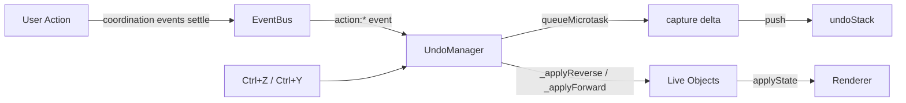
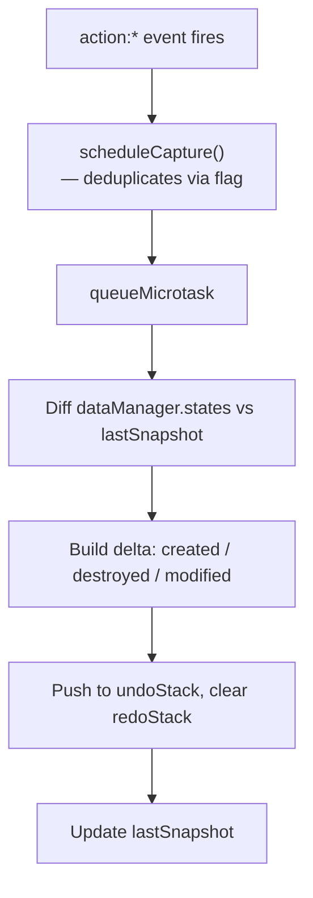
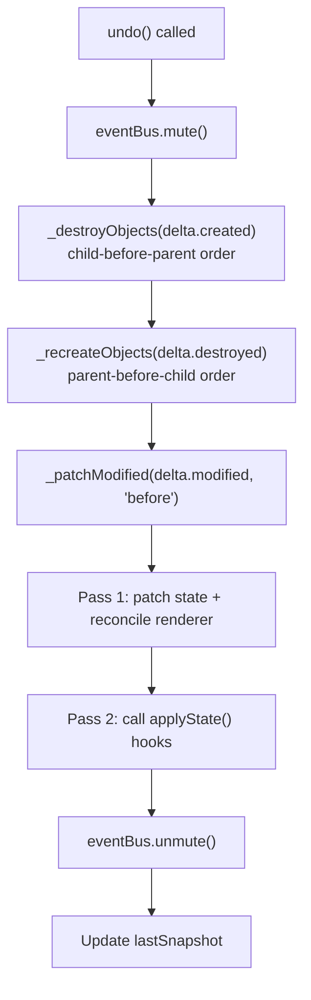
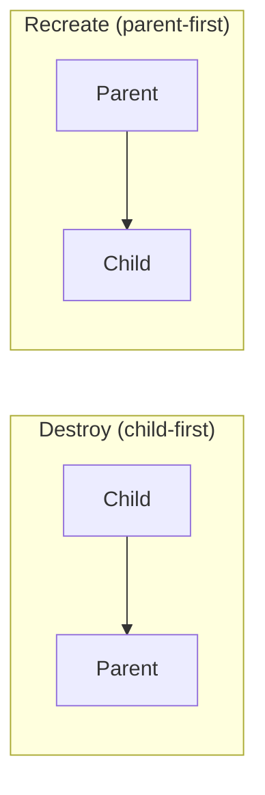
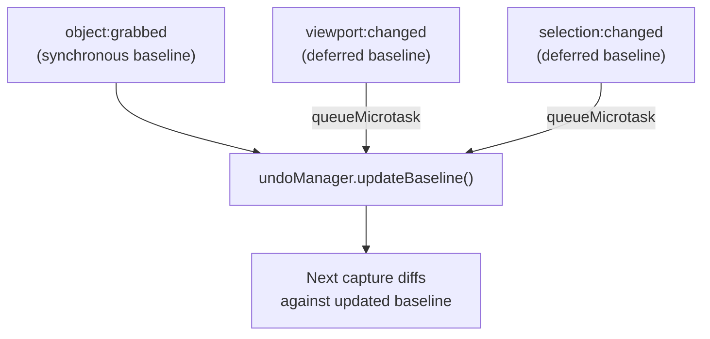
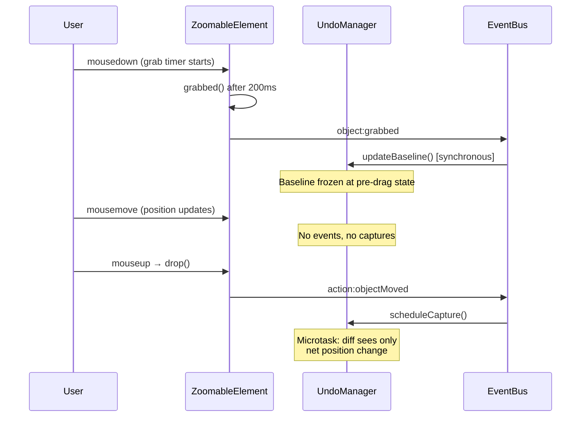

# Undo/Redo Architecture

## Overview

The UndoManager singleton (`undoManager` from `core/UndoManager.js`) provides event-triggered undo/redo using delta snapshots with surgical object reconciliation. It listens to `action:` events on the eventBus, captures what changed, and applies deltas in reverse/forward without rebuilding the entire DOM.



## Event Taxonomy

Events on the eventBus are classified into two categories:

| Category | Prefix | Purpose | Example |
|----------|--------|---------|---------|
| Action | `action:` | Marks a completed user action | `action:cardDrawn` |
| Coordination | none | Internal wiring between objects | `card:grabbed`, `selection:changed` |

The UndoManager only subscribes to action events for capture timing. Coordination events are muted during undo/redo to prevent double-mutations.

## Core Data Flow



## Delta Structure

Each undo entry is a delta object describing what changed:

```javascript
{
    created: {
        [objectId]: stateSnapshot    // objects that didn't exist before
    },
    destroyed: {
        [objectId]: stateSnapshot    // objects that no longer exist
    },
    modified: {
        [objectId]: {
            before: stateSnapshot,   // state before the action
            after: stateSnapshot     // state after the action
        }
    }
}
```

Deltas are compact — only affected objects are stored, not the full game state.

## Surgical Apply (Undo/Redo)



### Two-Pass Patching

Modified objects are patched in two passes to handle dependencies:

1. **Pass 1** — For each modified object: replace state values, reconcile parent/renderer (reparent DOM, update layout preset, mark dirty). Collect objects with `applyState()` hooks.
2. **Pass 2** — Call all deferred `applyState()` hooks. These can safely read other objects' settled state (e.g., Hand reads card dimensions after card's layout is updated).

### Reparenting During Undo

When an object's `state.parent.referenceId` changed, `_reconcileParent` handles:
- Update live `obj.parent` reference
- Move DOM element to new parent's div
- Update Renderer indexes (`childrenOf`, `viewportChildren`, `node.parentId`, `node.viewportId`)

### Destruction Ordering



- **Destroy**: children before parents (child's `destroy()` accesses parent's DOM)
- **Recreate**: parents before children (child's constructor calls `dataManager.getObject(parentId)`)

## Baseline Management

Non-undoable persistent mutations (pan, zoom, selection) must advance the baseline so they don't pollute the next delta.



**Critical timing**: `object:grabbed` advances the baseline **synchronously** because coordination events (`card:grabbed` → Hand removes card) fire immediately after in the same call stack. Deferring would include those mutations in the baseline, making them invisible to the delta.

## Event Wiring

### Action Events → Capture

```javascript
const UNDOABLE_EVENTS = [
    'action:cardDrawn',
    'action:cardPlaced',
    'action:cardReturnedToHand',
    'action:objectCreated',
    'action:objectMoved',
    'action:objectDeleted',
    'action:objectFlipped',
];
```

Multiple action events in the same synchronous block are deduplicated into one capture via the `_captureScheduled` flag.

### Baseline Events → Advance Baseline

```javascript
const BASELINE_EVENTS = [
    'object:grabbed',     // synchronous — freezes pre-drag state
    'viewport:changed',   // deferred — pan/zoom
    'selection:changed',  // deferred — selection is persisted but not undoable
];
```

## Object Reconciliation (`applyState`)

Types with derived runtime state implement `applyState()` to reconcile after patching:

| Type | What `applyState()` does |
|------|--------------------------|
| ViewPort | Recalculate `scaleX`/`scaleY`, notify viewport children |
| FlippableObject | Set wrapper CSS transform (no transition) |
| Stage | Rebuild `this.children` array, register untracked children with zManager |
| GameStage | Rebuild `this.hand`/`this.settingsPanel` refs, re-render panel |
| StageSelectionManager | Rebuild `this.selected` map, reapply CSS classes |
| Hand | Rebuild `this.cards`, re-register on zManager layer 1, reposition fan |

Types without `applyState()` (Card, Tile, Deck, Panel) rely on the generic renderer update (`updateLayoutPreset` + `markDirty`).

## Drag Flow



### Spawner Exception

The tile spawner creates an object and immediately starts a drag. The `_isNewlySpawned` flag ensures:
- `object:grabbed` is NOT emitted (baseline stays at pre-spawn state)
- On drop, `action:objectCreated` fires instead of `action:objectMoved`
- The delta captures both creation and final position — undo destroys the tile entirely

## Fallback Safety Net

Surgical apply is wrapped in try/catch. On failure:
1. Log a warning with the error
2. Reconstruct target state from the delta (state-level apply)
3. Call `dataManager.restoreData()` for a full DOM rebuild

This ensures undo never crashes the app — worst case is a visual flicker.

## Save/Load Integration

- **Save**: does not touch undo stacks
- **Load**: calls `undoManager.init()` — clears stacks, takes fresh baseline
- **New**: same as Load — fresh baseline, empty history
- Undo stacks are session-only (not persisted in save files)

## Keyboard Shortcuts

| Shortcut | Action |
|----------|--------|
| Ctrl+Z | `undoManager.undo()` |
| Ctrl+Y | `undoManager.redo()` |

Both are blocked during active drag (`renderer.isDragging()`).

## Public API

| Method | Purpose |
|--------|---------|
| `init()` | Reset stacks, take baseline (call after game setup or load) |
| `scheduleCapture()` | Queue a delta capture (called by event wiring) |
| `updateBaseline()` | Advance baseline without creating undo entry |
| `undo()` | Pop undoStack, apply reverse delta |
| `redo()` | Pop redoStack, apply forward delta |
