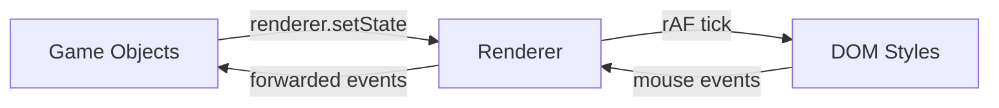
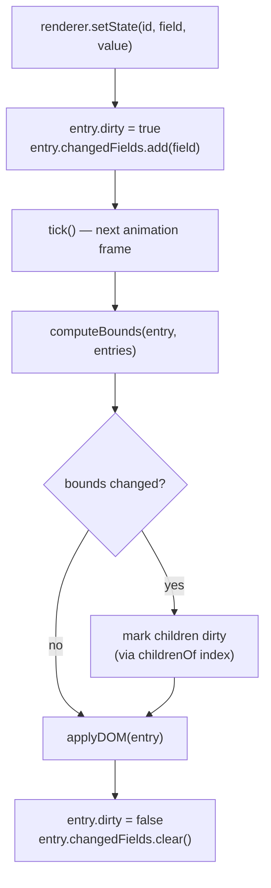
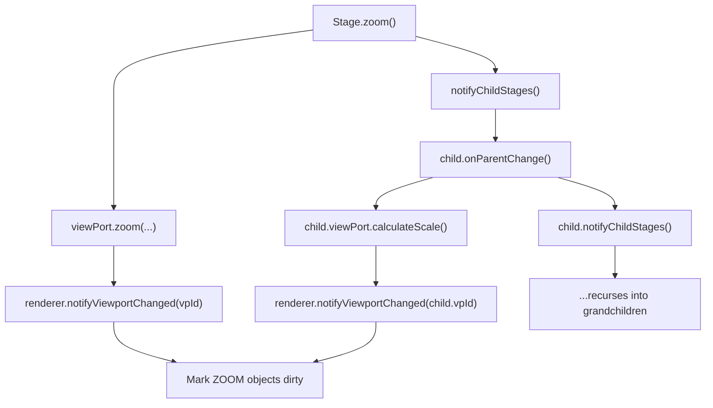
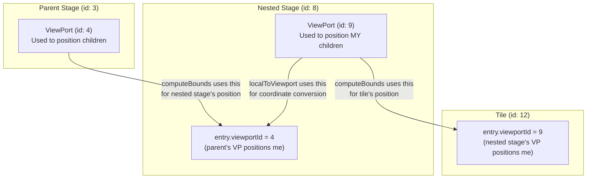

# Rendering Layer Architecture

## Overview

The Renderer singleton (`renderer` from `rendering/Renderer.js`) sits between game objects and the DOM. It decouples state mutations from visual updates by batching DOM writes into a single `requestAnimationFrame` loop.



## Core Data Flow



## Viewport Propagation (Recursive)

When a stage zooms or pans, nested stages must recalculate their own viewport scales. The Renderer only handles DOM dirty propagation — viewport recalculation is a logical operation triggered explicitly.



## Two Viewports — Critical Distinction

Each registered entry has a `viewportId`. This is the viewport used to compute **this object's** screen position (its parent's viewport). But `localToViewport()` needs the stage's **own** viewport to convert screen coordinates to world coordinates.



- `computeBounds` reads `entry.viewportId` → parent's viewport → positions the object on screen
- `localToViewport` reads `stageObj.viewPort` → stage's own viewport → converts screen coords to world coords

## screenToLocal — Parent Chain Walk

Bounds are relative to the parent container, not the page. To convert page-relative mouse coordinates to object-local coordinates, `screenToLocal` accumulates offsets up the parent chain:

```
absX = object.bounds.x + parent.bounds.x + grandparent.bounds.x + ...
absY = object.bounds.y + parent.bounds.y + grandparent.bounds.y + ...
localX = clientX - rootEl.left - absX
localY = clientY - rootEl.top - absY
```

This handles arbitrarily nested objects (tiles inside nested stages inside the main stage).

## First Render Mechanism

When objects are created (or recreated from a save file), their DOM elements are fresh — no styles applied yet. But their state may already contain values for rotation, filter, zIndex (loaded from save).

Problem: `setState` skips writes when the value equals the current state. After loading, the state already has the correct values, so `setState` calls are no-ops and `changedFields` stays empty.

Solution: `firstRender` flag on each entry. On the first `applyDOM` call, ALL visual properties are written unconditionally regardless of `changedFields`. After that, only changed fields are applied.

## applyDOM — What Gets Written

| Property | When written | Notes |
|---|---|---|
| left, top, width, height | Always (every dirty frame) | Bounds depend on external factors |
| zIndex | `changedFields.has('zIndex')` or firstRender | Only changes via setState |
| transform, transformOrigin | `changedFields.has('rotation')` or `changedFields.has('transformOrigin')` or firstRender | Both fields trigger the same block |
| -webkit-filter | `changedFields.has('filter')` or firstRender | Only changes via setState |

## Layout Computation

`computeBounds(entry, entries)` is a pure function that computes screen-pixel position and dimensions:

| Layout Mode | Position Formula | Dimension Formula |
|---|---|---|
| RELATIVE | `state.x * parent.width` | `state.width * parent.width` |
| ZOOM + ABSOLUTE | `(state.x - vp.x) * vp.scaleX` | `state.width * vp.scaleX` |
| FIXED + ABSOLUTE | `state.x` | `state.width` |
| FIXED + ABSOLUTE + scale | `state.x` | `state.width * uiScale` |

Where `uiScale = Math.min(rootWidth/1920, rootHeight/1080)`.

## Input Handling

Centralized on the root element (`#content`). No per-element listeners on managed objects.

- **Hit testing**: `elementFromPoint` + `closest('[data-object-id]')` finds the target
- **Drag capture**: `startDrag(id)` routes all mousemove/mouseup to one object until `endDrag()`
- **Wheel bubbling**: walks up the object hierarchy until finding an `onWheel` handler (cards/tiles don't handle wheel, so it reaches the Stage)
- **Drag initiation**: `onMouseDown` calls `startDrag` immediately (not after the 200ms grab timeout) so that mousemove/mouseup are captured during the picking phase

## Performance: childrenOf Index

`tick()` needs to mark children dirty when a parent's bounds change. Instead of scanning all entries (O(n) per parent), a `childrenOf` Map provides O(k) lookup:

```
childrenOf: Map<parentId, Set<childId>>
```

Maintained automatically by `register()`, `unregister()`, and `clear()`.

## Save/Load Integration

`DataManager.restoreData()` calls `renderer.clear()` before recreating objects. This wipes stale entries. The render loop keeps running (rAF is async, so no tick fires during synchronous recreation). Recreated objects register fresh entries with `firstRender: true`.

## Public API Summary

| Method | Purpose |
|---|---|
| `start(rootEl)` | Start loop, attach listeners |
| `stop()` | Stop loop, remove listeners |
| `register(id, opts)` | Add object to Renderer |
| `unregister(id)` | Remove object |
| `clear()` | Remove all (for save/load) |
| `setState(id, field, value)` | Mutate state, mark dirty |
| `updateLayoutPreset(id)` | Re-read layout fields after preset swap |
| `getComputedBounds(id)` | Query cached screen bounds |
| `screenToLocal(x, y, id)` | Page coords → object-local coords |
| `localToViewport(x, y, stageId)` | Local coords → world coords |
| `notifyViewportChanged(vpId)` | Mark ZOOM objects dirty |
| `markAllDirty()` | Mark all dirty (resize) |
| `startDrag(id)` | Begin drag capture |
| `endDrag()` | End drag capture |
