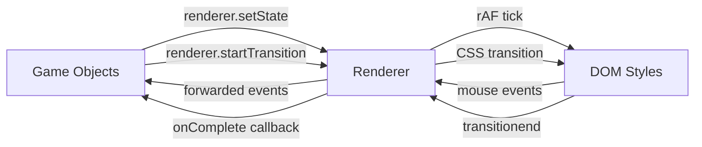
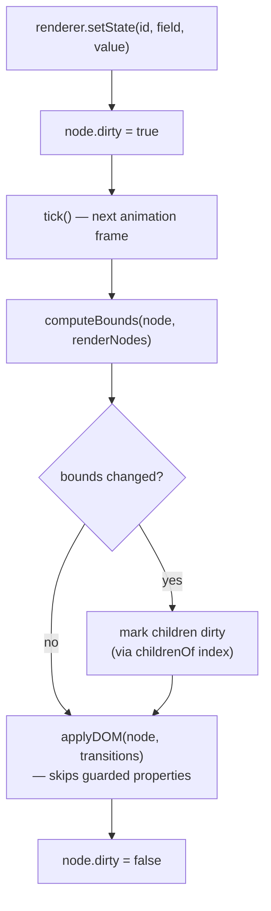
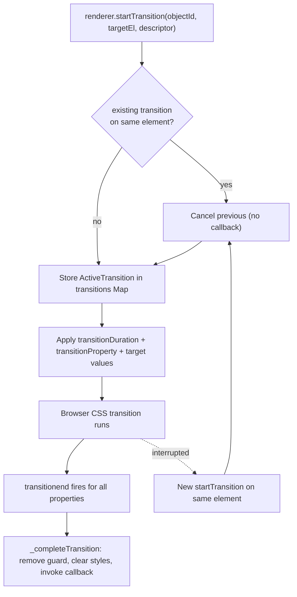
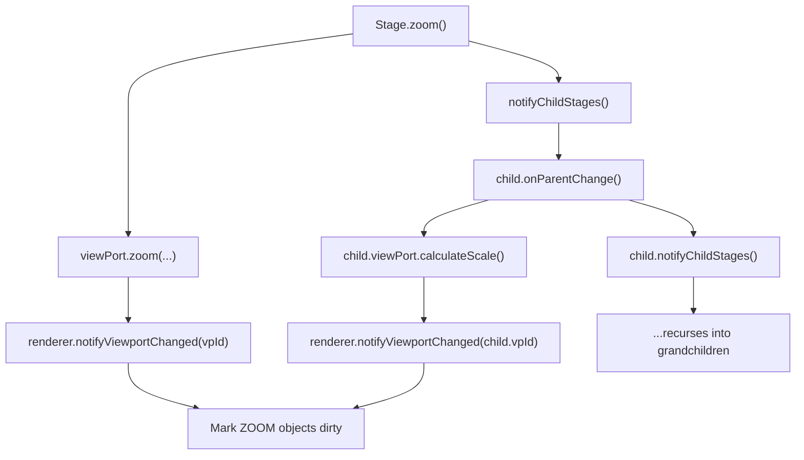
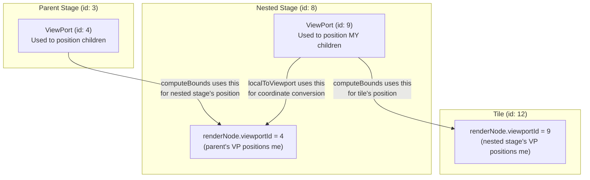

# Rendering Layer Architecture

## Overview

The Renderer singleton (`renderer` from `rendering/Renderer.js`) sits between game objects and the DOM. It decouples state mutations from visual updates by batching DOM writes into a single `requestAnimationFrame` loop. It also provides a generic CSS transition API for one-shot animations.



## Core Data Flow



## Transition System

The Renderer provides a generic, one-shot CSS transition API. Game objects call `renderer.startTransition()` to animate arbitrary CSS properties on managed DOM elements. The Renderer tracks active transitions, guards those properties from being overwritten by the dirty-flag loop, and handles completion/interruption/cleanup.

The transition system is intentionally generic — the Renderer has no knowledge of flip, slide, fade, or any specific animation. Game objects own the semantics; the Renderer owns the mechanism.

### Transition Lifecycle



### How Transitions Interact with the Dirty-Flag Loop

1. `startTransition()` is called synchronously by game objects (outside `tick()`).
2. The browser's CSS transition engine handles interpolation — no per-frame JS work.
3. `tick()` continues running. `applyDOM()` checks the `transitions` map and skips any CSS property currently owned by an active transition on the target element.
4. When `transitionend` fires for all tracked properties, the guard is removed and the property returns to normal dirty-flag control.

### Data Structures

```
transitions: Map<HTMLElement, ActiveTransition>
```

Keyed by DOM element reference (not objectId). This allows one object to have transitions on multiple child elements simultaneously. If a new transition arrives for the same element, the previous one is cancelled.

**ActiveTransition** (internal tracking object):
```javascript
{
    objectId,       // owning registered object
    targetEl,       // the DOM element being transitioned
    properties,     // Set<string> of CSS property names being guarded
    onComplete,     // callback reference (or null)
    listener        // bound transitionend handler (for removal)
}
```

**TransitionDescriptor** (passed by game objects):
```javascript
{
    duration: 800,                          // milliseconds
    properties: { transform: 'rotateY(180deg)', opacity: '0.5' },
    onComplete: () => { ... }               // optional, NOT called on interruption
}
```

### Guard Mechanism in applyDOM

`applyDOM` writes all visual properties unconditionally on every dirty frame, except those guarded by an active transition:

```javascript
const guarded = transitions.get(div)?.properties;

if (!guarded?.has('zIndex'))      → write zIndex
if (!guarded?.has('transform'))   → write transform + transformOrigin
if (!guarded?.has('filter'))      → write filter
```

Child-element transitions (e.g., the wrapper div inside FlippableObject) are keyed by the child element and don't interfere with the render node's main div writes.

### Cleanup

- **Interruption**: A new `startTransition` on the same element cancels the previous one. The old callback is NOT invoked.
- **Unregister**: `unregister(objectId)` cancels all transitions owned by that object.
- **Clear**: `clear()` cancels all active transitions across all objects.
- In all cancellation cases, event listeners are removed and transition styles are cleared.

## Viewport Propagation (Recursive)

When a stage zooms or pans, nested stages must recalculate their own viewport scales. The Renderer only handles DOM dirty propagation — viewport recalculation is a logical operation triggered explicitly.



## Two Viewports — Critical Distinction

Each registered render node has a `viewportId`. This is the viewport used to compute **this object's** screen position (its parent's viewport). But `localToViewport()` needs the stage's **own** viewport to convert screen coordinates to world coordinates.



- `computeBounds` reads `renderNode.viewportId` → parent's viewport → positions the object on screen
- `localToViewport` reads `stageObj.viewPort` → stage's own viewport → converts screen coords to world coords

## screenToLocal — Parent Chain Walk

Bounds are relative to the parent container, not the page. To convert page-relative mouse coordinates to object-local coordinates, `screenToLocal` accumulates offsets up the parent chain:

```
absX = object.bounds.x + parent.bounds.x + grandparent.bounds.x + ...
absY = object.bounds.y + parent.bounds.y + grandparent.bounds.y + ...
localX = clientX - rootEl.left - absX
localY = clientY - rootEl.top - absY
```

This handles arbitrarily nested objects (tiles inside nested stages inside the main stage).

## applyDOM — What Gets Written

| Property | When written | Notes |
|---|---|---|
| left, top, width, height | Always (every dirty frame) | Bounds depend on external factors |
| zIndex | Every dirty frame, unless guarded by active transition | Skipped if `transitions.get(div)?.properties.has('zIndex')` |
| transform, transformOrigin | Every dirty frame, unless guarded by active transition | Skipped if `transform` or `transformOrigin` is guarded |
| -webkit-filter | Every dirty frame, unless guarded by active transition | Skipped if `filter` is guarded |

All visual properties are written unconditionally — there is no field-level change tracking. The only reason a property is skipped is if an active transition currently owns it.

## Layout Computation

`computeBounds(node, renderNodes)` is a pure function that computes screen-pixel position and dimensions:

| Layout Mode | Position Formula | Dimension Formula |
|---|---|---|
| RELATIVE | `state.x * parent.width` | `state.width * parent.width` |
| ZOOM + ABSOLUTE | `(state.x - vp.x) * vp.scaleX` | `state.width * vp.scaleX` |
| FIXED + ABSOLUTE | `state.x` | `state.width` |
| FIXED + ABSOLUTE + scale | `state.x` | `state.width * uiScale` |

Where `uiScale = Math.min(rootWidth/1920, rootHeight/1080)`.

## Input Handling

Centralized on the root element (`#content`). No per-element listeners on managed objects.

- **Hit testing**: `elementFromPoint` + `closest('[data-object-id]')` finds the target
- **Drag capture**: `startDrag(id)` routes all mousemove/mouseup to one object until `endDrag()`
- **Wheel bubbling**: walks up the object hierarchy until finding an `onWheel` handler (cards/tiles don't handle wheel, so it reaches the Stage)
- **Drag initiation**: `onMouseDown` calls `startDrag` immediately (not after the 200ms grab timeout) so that mousemove/mouseup are captured during the picking phase

## Performance: childrenOf Index

`tick()` needs to mark children dirty when a parent's bounds change. Instead of scanning all render nodes (O(n) per parent), a `childrenOf` Map provides O(k) lookup:

```
childrenOf: Map<parentId, Set<childId>>
```

Maintained automatically by `register()`, `unregister()`, and `clear()`.

## Save/Load Integration

`DataManager.restoreData()` calls `renderer.clear()` before recreating objects. This wipes stale render nodes and cancels all active transitions. The render loop keeps running (rAF is async, so no tick fires during synchronous recreation). Recreated objects register fresh render nodes.

## Public API Summary

| Method | Purpose |
|---|---|
| `start(rootEl)` | Start loop, attach listeners |
| `stop()` | Stop loop, remove listeners |
| `register(id, opts)` | Add object to Renderer |
| `unregister(id)` | Remove object (cancels transitions) |
| `clear()` | Remove all (cancels transitions, for save/load) |
| `setState(id, field, value)` | Mutate state, mark dirty |
| `startTransition(id, targetEl, descriptor)` | Start a CSS transition on a managed element |
| `updateLayoutPreset(id)` | Re-read layout fields after preset swap |
| `getComputedBounds(id)` | Query cached screen bounds |
| `screenToLocal(x, y, id)` | Page coords → object-local coords |
| `localToViewport(x, y, stageId)` | Local coords → world coords |
| `notifyViewportChanged(vpId)` | Mark ZOOM objects dirty |
| `markAllDirty()` | Mark all dirty (resize) |
| `startDrag(id)` | Begin drag capture |
| `endDrag()` | End drag capture |
